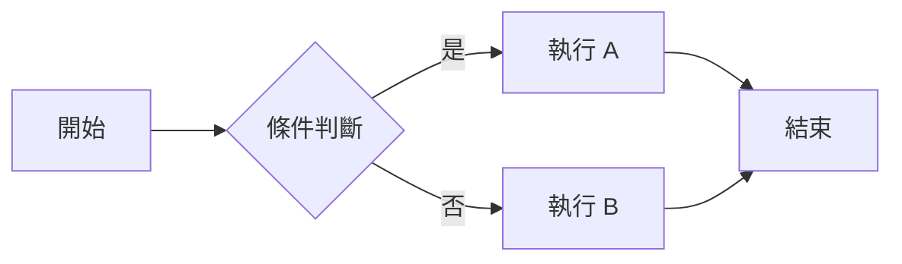
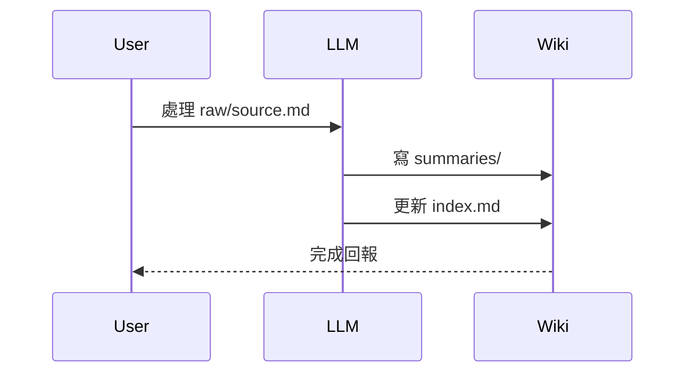
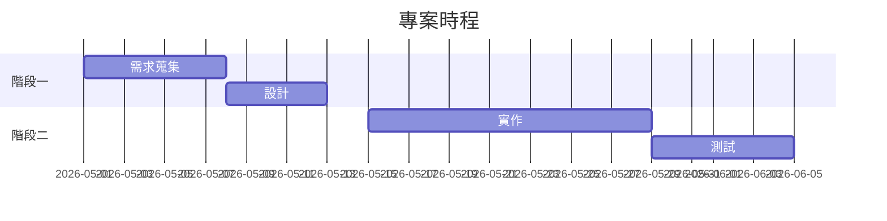

# Markdown 語法範例（IDE 預覽相容）

> 本檔收錄所有能在 VSCode / GitHub / 一般 IDE 預覽模式正常渲染的 Markdown 語法。
> 不包含 Obsidian 私有語法（wikilinks、embeds、dataview 等）。

---

## 1. 標題 Headings

# H1 一級標題
## H2 二級標題
### H3 三級標題
#### H4 四級標題
##### H5 五級標題
###### H6 六級標題

---

## 2. 文字樣式 Text Styling

**粗體文字**（雙星號）

*斜體文字*（單星號）

***粗斜體***（三星號）

~~刪除線~~（雙波浪）

`行內程式碼`（反引號）

普通段落文字。連續兩個空白後換行  
這一行會緊接在上一行下方。

段落之間隔一個空白行就會分段。

---

## 3. 清單 Lists

### 無序清單

- 第一項
- 第二項
  - 巢狀第一項
  - 巢狀第二項
    - 再巢狀
- 第三項

### 有序清單

1. 第一步
2. 第二步
   1. 子步驟 A
   2. 子步驟 B
3. 第三步

### 任務清單 Task List（GFM）

- [x] 已完成的任務
- [x] 另一個完成的任務
- [ ] 未完成的任務
- [ ] 待辦事項
  - [x] 子任務（完成）
  - [ ] 子任務（未完成）

---

## 4. 連結與圖片 Links & Images

### 連結

[行內連結到 GitHub](https://github.com)

[相對路徑連結到專案內檔案](./CLAUDE.md)

[相對路徑連結到子目錄](./prompts/ingest.md)

自動連結：<https://www.example.com>

參考式連結：[Anthropic 官網][anthropic-ref]

[anthropic-ref]: https://www.anthropic.com

### 圖片

```markdown


```

---

## 5. 引用區塊 Blockquotes

> 這是一段引用文字。
> 可以跨多行。
>
> > 巢狀引用區塊。
> > 再加一層也可以。
>
> 回到第一層引用。

### GitHub Alerts（GFM 新版，VSCode 與 GitHub 支援）

> [!NOTE]
> 一般註記。用於補充說明。

> [!TIP]
> 小撇步。建議或最佳實踐。

> [!IMPORTANT]
> 重要資訊。使用者必須注意。

> [!WARNING]
> 警告訊息。有潛在風險。

> [!CAUTION]
> 注意。可能造成負面後果。

---

## 6. 程式碼 Code

### 行內程式碼

使用 `npm install` 來安裝依賴。變數 `userName` 是字串型別。

### 程式碼區塊（無語法高亮）

```
這是一段純文字的程式碼區塊。
沒有指定語言。
```

### 程式碼區塊（含語法高亮）

```javascript
function greet(name) {
  console.log(`Hello, ${name}!`);
  return name.toUpperCase();
}

greet('World');
```

```python
def fibonacci(n):
    if n <= 1:
        return n
    return fibonacci(n - 1) + fibonacci(n - 2)

print([fibonacci(i) for i in range(10)])
```

```bash
#!/bin/bash
for file in *.md; do
  echo "Processing $file"
done
```

```json
{
  "name": "example",
  "version": "1.0.0",
  "dependencies": {
    "react": "^18.0.0"
  }
}
```

```typescript
interface User {
  id: number;
  name: string;
  email?: string;
}

const getUser = async (id: number): Promise<User> => {
  const res = await fetch(`/api/users/${id}`);
  return res.json();
};
```

```yaml
name: CI
on:
  push:
    branches: [main]
jobs:
  test:
    runs-on: ubuntu-latest
    steps:
      - uses: actions/checkout@v3
```

---

## 7. 表格 Tables

### 基本表格

| 欄位 A | 欄位 B | 欄位 C |
|--------|--------|--------|
| A1     | B1     | C1     |
| A2     | B2     | C2     |
| A3     | B3     | C3     |

### 對齊（左 / 中 / 右）

| 左對齊 | 置中 | 右對齊 |
|:-------|:----:|-------:|
| Apple  | 🍎   |  $1.00 |
| Banana | 🍌   |  $0.50 |
| Cherry | 🍒   |  $3.25 |

### 表格內含格式

| 功能 | 狀態 | 說明 |
|------|------|------|
| **粗體** | ✅ | 表格內可用 |
| `code` | ✅ | 行內程式碼 OK |
| [連結](https://example.com) | ✅ | 連結也可以 |
| ~~刪除~~ | ⚠️ | 也支援 |

---

## 8. 分隔線 Horizontal Rules

三個以上的減號：

---

三個以上的星號：

***

三個以上的底線：

___

---

## 9. 跳脫字元 Escape Characters

用反斜線跳脫 Markdown 特殊符號：

- \*不會變成斜體\*
- \`不會變成程式碼\`
- \[不會變成連結\]
- \# 不會變成標題
- \\ 顯示一個反斜線

---

## 10. HTML 內嵌（IDE / GitHub 支援，子集）

<details>
<summary>點擊展開 / 收合</summary>

這裡是可以折疊的內容。常用於：
- 隱藏冗長的範例
- 隱藏除錯輸出
- 表格內容過長時折疊

```javascript
console.log('折疊內的程式碼也能渲染');
```

</details>

<br>

可以用 `<sub>下標</sub>` 與 `<sup>上標</sup>`：H<sub>2</sub>O、E = mc<sup>2</sup>

用 `<kbd>` 表示鍵盤按鍵：按 <kbd>Ctrl</kbd> + <kbd>C</kbd> 複製。

---

## 11. 數學公式 Math（VSCode 需擴充；GitHub 已內建）

行內公式：$E = mc^2$

區塊公式：

$$
\int_{-\infty}^{\infty} e^{-x^2} \, dx = \sqrt{\pi}
$$

$$
\begin{aligned}
f(x) &= ax^2 + bx + c \\
f'(x) &= 2ax + b
\end{aligned}
$$

> VSCode 需安裝 `Markdown+Math` 或 `Markdown All in One` 擴充才能渲染。GitHub 與 Obsidian 內建支援。

---

## 12. Mermaid 圖表（GitHub / Obsidian 內建；VSCode 需擴充）







---

## 13. 表情符號 Emoji

直接貼 Unicode emoji 最穩：✅ ❌ ⚠️ 🚀 📝 💡 🐛 ✨ 🎉 📦

GitHub shortcode（GitHub 渲染，IDE 大多不支援）：`:smile:` `:rocket:` `:warning:`

---

## 14. YAML Frontmatter

檔案最開頭三條減號之間的區塊（**本檔開頭就有一份**）：

```yaml
---
title: 頁面標題
type: entity | concept | summary | synthesis
tags: [tag1, tag2]
sources: [../raw/source.md]
updated: 2026-05-12
---
```

- VSCode：顯示為 YAML 區塊（有語法高亮）
- GitHub：自動隱藏並可能在側邊顯示
- Obsidian：渲染成 Properties panel

---

## 15. 註腳 Footnotes（GFM）

這是一段文字[^1]，後面接另一個註腳[^note]。

[^1]: 這是第一個註腳的內容。
[^note]: 註腳的名稱可以是文字，渲染時會自動編號。

---

## 16. 定義列表 Definition List（部分 IDE 支援）

Term 1
: 第一個定義內容

Term 2
: 第二個定義內容
: 同一個 term 可以有多個定義

> ⚠️ VSCode 內建預覽不支援，需 `Markdown Preview Enhanced` 擴充；GitHub 不支援。

---

## 17. 縮排程式碼區塊（舊式，仍可用）

連續四個空白縮排也能形成程式碼區塊：

    這是用四空白縮排的程式碼區塊
    不需要 ``` 圍欄
    但無法指定語言高亮

建議仍以 ``` 圍欄式為主。

---

## 結語

以上是 IDE 預覽模式可渲染的 Markdown 語法總集。若需要 Obsidian 私有語法（wikilinks、embeds、callouts 擴充類型、dataview 等），請另外整理。

完整對照表見 [Obsidian 圖片附件設定.md](./Obsidian%20圖片附件設定.md) 同層討論紀錄。
